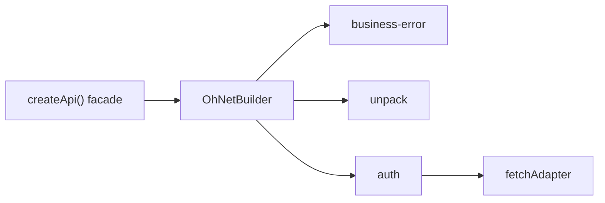

# {{ $frontmatter.title }}

This example turns ohnet into a typed SDK for one concrete backend. The backend wraps every reply in an envelope, expects a bearer token, and reports business failures with a numeric `code` inside a `200 OK` body. The finished client hides all of that behind plain methods such as `api.me.get()`.

## The Contract

Every endpoint replies with the same envelope:

```json
{ "code": 0, "data": {}, "message": "ok" }
```

- `code: 0` means success; `data` is the payload.
- Any other `code` is a business failure; `data` carries the details.
- `code: 401` means the access token is stale and the request should be retried after a refresh.
- Auth uses `Authorization: Bearer <token>`.

The goal: callers only ever see `data`, and failures arrive as typed errors.

## Layering



Three middlewares, registered in that order. Because `leave` hooks run in reverse, the auth hook sees the raw envelope first, then unpack strips it, then the error mapper inspects what is left.

## 1. Typed Errors

Start from `OhNetError` so the errors stay `instanceof`-friendly and keep the `type` / `code` / `data` shape.

```ts
import { OhNetError } from "@xtwis/ohnet"

export class BusinessError extends OhNetError {
  constructor(code: number, message: string, data?: unknown) {
    super("BUSINESS", String(code), message, data)
  }
}

export class UnauthorizedError extends BusinessError {
  constructor(data?: unknown) {
    super(401, "unauthorized", data)
  }
}

export class NotFoundError extends BusinessError {
  constructor(data?: unknown) {
    super(404, "not found", data)
  }
}

export class ValidationError extends BusinessError {
  constructor(data?: unknown) {
    super(422, "validation failed", data)
  }
}

export class AuthExpiredError extends OhNetError {
  constructor() {
    super("AUTH", "AUTH_EXPIRED", "auth refresh failed")
  }
}
```

## 2. A Shared Envelope Guard

Both middlewares need to know whether a body is an envelope. One type guard keeps that decision in a single place.

```ts
interface Envelop {
  code: number
  data: unknown
  message: string
}

function isEnvelop(value: unknown): value is Envelop {
  return typeof value === "object" && value !== null
    && "code" in value && "data" in value && "message" in value
}
```

## 3. Unpack the Envelope

On success, replace `response.data` with the inner payload. Nothing else changes, so the caller's `T` describes the payload, not the envelope.

```ts
import type { OhNetAdapter, OhNetContext } from "@xtwis/ohnet"
import { OhNetMiddleware } from "@xtwis/ohnet"

class UnpackMiddleware extends OhNetMiddleware {
  readonly name = "unpack"

  readonly leave = async (_adapter: OhNetAdapter, context: OhNetContext): Promise<void> => {
    if (!context.response)
      return
    const body = context.response.data
    if (isEnvelop(body) && body.code === 0)
      context.response.data = body.data
  }
}
```

## 4. Map Business Codes to Errors

When the envelope carries a non-zero `code`, throw the matching class. `controls.terminate()` stops the rest of the leave chain, so no later middleware sees a body that is about to become an exception.

```ts
import type { OhNetMiddlewareLeaveControls } from "@xtwis/ohnet"

const ERROR_MAP: Record<number, new (data?: unknown) => BusinessError> = {
  401: UnauthorizedError,
  404: NotFoundError,
  422: ValidationError,
}

class BusinessErrorMiddleware extends OhNetMiddleware {
  readonly name = "business-error"

  readonly leave = async (
    _adapter: OhNetAdapter,
    context: OhNetContext,
    controls: OhNetMiddlewareLeaveControls,
  ): Promise<void> => {
    if (!context.response)
      return
    const body = context.response.data
    if (!isEnvelop(body) || body.code === 0)
      return

    controls.terminate()

    const ErrorClass = ERROR_MAP[body.code]
    if (ErrorClass)
      throw new ErrorClass(context.response)
    throw new BusinessError(body.code, body.message, context.response)
  }
}
```

The whole response is attached as `error.data`, so catch sites can still read status, headers, and the original envelope:

```ts
try {
  await api.me.get()
}
catch (error) {
  if (error instanceof NotFoundError) {
    const response = error.data as { status: number }
    console.log(response.status) // 200
  }
}
```

## 5. Refresh on 401

The auth middleware injects the token on the way in and refreshes on the way out. `401` is a retry signal, not a user-facing failure.

```ts
import { OhNetBuilder } from "@xtwis/ohnet"

interface AuthOptions {
  getToken: () => string | undefined
  refresh: () => Promise<Session>
  onTokens: (session: Session) => void
}

class AuthMiddleware extends OhNetMiddleware {
  readonly name = "auth"

  constructor(private readonly options: AuthOptions) {
    super()
  }

  readonly enter = async (_adapter: OhNetAdapter, context: OhNetContext): Promise<void> => {
    const token = this.options.getToken()
    if (token)
      context.request.headers.set("Authorization", `Bearer ${token}`)
  }

  readonly leave = async (
    _adapter: OhNetAdapter,
    context: OhNetContext,
    controls: OhNetMiddlewareLeaveControls,
  ): Promise<void> => {
    if (!context.response)
      return
    const body = context.response.data
    if (!isEnvelop(body) || body.code !== 401)
      return

    try {
      const session = await this.options.refresh()
      this.options.onTokens(session)
      controls.retry()
    }
    catch {
      controls.terminate()
      throw new AuthExpiredError()
    }
  }
}
```

`controls.retry()` schedules a full pipeline run. The dispatcher clears `response` and `error` first, so the retry starts clean, re-enters every `enter` hook (now with the fresh token), and calls the adapter again.

## 6. Model the Types

The facade speaks in domain terms: a `Session`, a `User`, a token store, and a grouped `Api` surface.

```ts
export interface Session {
  accessToken: string
  refreshToken: string
  expiresIn: number
}

export interface User {
  id: string
  name: string
  email: string
}

export interface TokenStorage {
  get: () => { accessToken: string, refreshToken: string } | undefined
  set: (session: Session) => void
  clear: () => void
}

export interface Api {
  auth: {
    login: (data?: unknown) => Promise<Session>
    logout: () => Promise<null>
  }
  me: {
    get: () => Promise<User>
  }
}
```

## 7. Compose the Facade

The refresh call must not go through the auth middleware, or a stale token would trigger a refresh that triggers another refresh forever. Build a second client that only unpacks and maps errors, and use it for `/auth/refresh`. The facade is then a thin object of arrow functions: each method picks a verb, fixes the path, and states the payload type. Nothing about envelopes, tokens, or status codes leaks out.

```ts
export function createApi(options: {
  baseURL: string
  storage: TokenStorage
}): Api {
  // No auth middleware here: this client is what refreshes the token.
  const refreshClient = new OhNetBuilder({ url: options.baseURL })
    .with(new UnpackMiddleware())
    .with(new BusinessErrorMiddleware())

  const auth = new AuthMiddleware({
    getToken: () => options.storage.get()?.accessToken,
    refresh: async (): Promise<Session> => {
      const pair = options.storage.get()
      if (!pair)
        throw new AuthExpiredError()
      return refreshClient.post<Session>("/auth/refresh", { refreshToken: pair.refreshToken })
    },
    onTokens: session => options.storage.set(session),
  })

  const client = new OhNetBuilder({ url: options.baseURL })
    .with(new BusinessErrorMiddleware())
    .with(new UnpackMiddleware())
    .with(auth)

  return {
    auth: {
      login: data => client.post<Session>("/auth/login", data ?? {}),
      logout: () => client.post<null>("/auth/logout"),
    },
    me: {
      get: () => client.get<User>("/auth/me"),
    },
  }
}
```

## What Happens on a 401

With `business-error`, `unpack`, `auth` registered in that order, a stale token produces this sequence:

1. `auth.enter` attaches `Authorization: Bearer <stale>`.
2. The adapter returns `{ code: 401 }` with `200 OK`.
3. `auth.leave` runs first, sees `401`, refreshes, and calls `controls.retry()`.
4. The dispatcher abandons the current leave chain and reruns the pipeline.
5. `auth.enter` attaches the new token; the adapter returns the real payload.
6. `auth.leave` sees `code: 0` and returns; `unpack` unwraps; `business-error` sees a plain payload and returns.
7. The caller receives `data` and never knows a refresh happened.

If the refresh itself fails, `auth.leave` calls `controls.terminate()` and throws `AuthExpiredError`, and both the retry and the remaining leave hooks are skipped.

## Next

- [Middleware Recipes](./middleware.md): reusable pieces this example only sketches.
- [Testing and Mock Adapters](./testing.md): assert this flow without a network.
- [Error Handling](../guide/errors.md): the error hierarchy in full.
