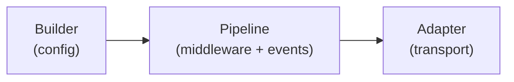
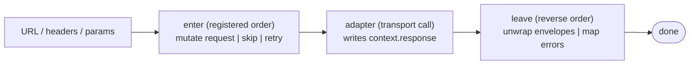

# {{ $frontmatter.title }}

Before diving into individual APIs, this page sketches ohnet's overall architecture. The library has only three moving parts; everything else hangs off them.

## The Three Parts

- **Builder**: the entry point. Holds the URL, headers, middlewares, and event handlers. Every configuration call produces a derived instance; nothing is mutated.
- **Pipeline**: the runtime that walks a request through middlewares and into the adapter. It emits lifecycle events and supports `skip` / `terminate` / `retry` controls.
- **Adapter**: the single seam between ohnet and a concrete transport. Adapters match a tiny `(context) => Promise<response>` signature, so the same pipeline drives `fetch`, `axios`, gRPC, `WebSocket`, or an in-memory mock.

The three parts are deliberately independent. You can replace the transport without touching middleware, add middleware without touching the builder, or write a fresh builder wrapper without touching either.

## How a Request Flows

events: `START`, then `REQUEST`, then adapter, then `RESPONSE`, then one of `SUCCESS` / `SKIP` / `ERROR`, then `FINISH`

Each middleware sees the same `context` object: it can read and mutate `request` before the adapter, and inspect `response` or `error` after.

## What's NOT a Concept

A few things look like abstractions but are deliberately small:

- **Headers**: just an `OhNetHeader` collection with RFC 7230 validation. No API surface to learn.
- **Errors**: a flat hierarchy. Branch on `instanceof` and `code`, never on `message`.
- **Events**: eight named hooks. Register handlers with `.on(event, fn)`; nothing more to it.

## Next

You have enough to read the rest. Start with whichever matters most:

- [Builder](./builder.md): the surface you touch most often.
- [Pipeline](./pipeline.md): middleware and lifecycle events.
- [HTTP Requests](./http.md): the practical reference for verbs, decoding, and query strings.
