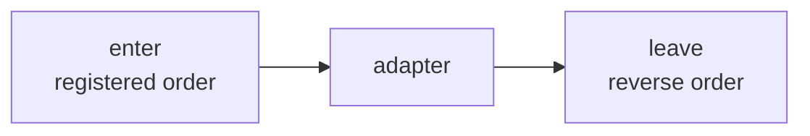
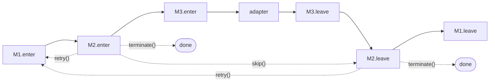
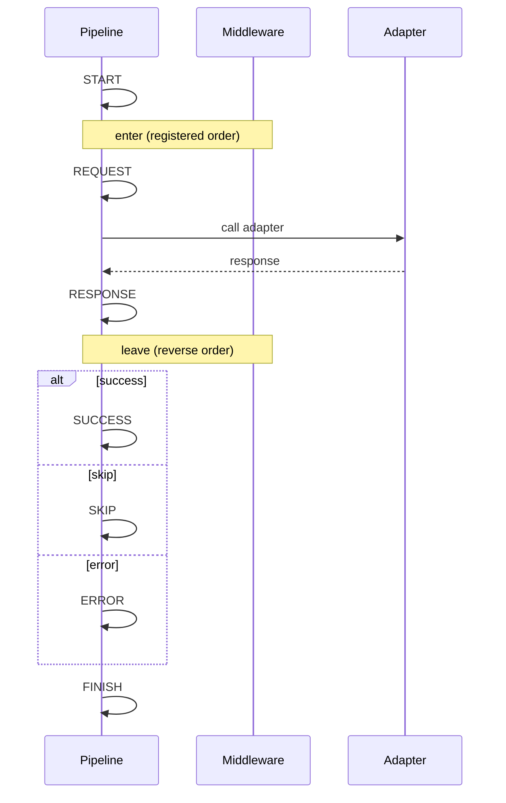

# {{ $frontmatter.title }}

The pipeline is the runtime that walks each request through middlewares and into the adapter. It owns the request lifecycle, the control flow (`skip` / `terminate` / `retry`), and the eight lifecycle events.

## Middleware

Subclass `OhNetMiddleware` to plug into the request pipeline. A middleware has a stable `name`, an optional `enter` hook, and an optional `leave` hook:

```ts
import type { OhNetContext } from "@xtwis/ohnet"
import { OhNetMiddleware } from "@xtwis/ohnet"

class TimingMiddleware extends OhNetMiddleware {
  readonly name = "timing"

  enter(_adapter, context) {
    context.meta.startedAt = Date.now()
  }

  leave(_adapter, context) {
    const started = context.meta.startedAt as number
    console.log(`elapsed: ${Date.now() - started}ms`)
  }
}
```

### Hook Order



`enter` hooks fire in registration order, before the adapter runs. `leave` hooks fire in **reverse** registration order, after the adapter returns. The pairing is the same shape as Koa / onion middleware: each middleware's `leave` sees what later middlewares already wrote.

### `name`

`name` is a stable string used as the identity for replacement and removal. Registering two middlewares with the same name swaps the implementation in the same slot; passing the same name to `clean()` removes it entirely.

`name` must be non-empty. Whitespace-only names are rejected with `OHNET_MIDDLEWARE_NAME` before they can affect the pipeline.

## Controls

Each hook receives a `controls` object:

| Method                 | Phase          | Effect                                                                                                                          |
| ---------------------- | -------------- | ------------------------------------------------------------------------------------------------------------------------------- |
| `controls.skip()`      | enter          | Adapter does not run; pipeline ends with `OHNET_SKIPPED` unless `context.response` was populated (in which case `SUCCESS` wins) |
| `controls.terminate()` | enter or leave | Subsequent `enter` (or `leave`) hooks do not run                                                                                |
| `controls.retry()`     | enter or leave | Re-runs the entire pipeline from the top, capped at `request.middlewareRetries`                                                 |

### Controls in the Pipeline



`skip` and `terminate` both short-circuit, but they suppress different chains: `skip` stops the enter chain only (leave still runs), while `terminate` stops both enter and leave.

`retry()` schedules a fresh pipeline run. Each call increments the retry counter; once it exceeds `request.middlewareRetries` (default `1`), the request fails with `OHNET_RETRY_EXHAUSTED`.

### Retry Example

```ts
import type { OhNetContext, OhNetMiddlewareLeaveControls } from "@xtwis/ohnet"
import { OhNetMiddleware } from "@xtwis/ohnet"

class NetworkRetryMiddleware extends OhNetMiddleware {
  readonly name = "network-retry"
  readonly leave = async (
    _adapter,
    context: OhNetContext,
    controls: OhNetMiddlewareLeaveControls,
  ) => {
    const code = (context.error as { code?: string } | null)?.code
    if (code === "OHNET_NETWORK")
      controls.retry()
  }
}

const client = new OhNetBuilder({
  url: "https://api.example.com",
  middlewareRetries: 3,
}).with(new NetworkRetryMiddleware())
```

## Lifecycle Events

Register handlers against any of the 8 events using the `OHNET_EVENT` constants:

```ts
import { OHNET_EVENT } from "@xtwis/ohnet"

const client = new OhNetBuilder({ url: BASE })
  .on(OHNET_EVENT.START, (_, ctx) => trace.begin(ctx.request.url))
  .on(OHNET_EVENT.SUCCESS, (_, ctx) => trace.end(ctx.response?.status))
  .on(OHNET_EVENT.ERROR, (_, ctx) => trace.fail(ctx.error))
  .on(OHNET_EVENT.FINISH, () => trace.flush())
```

### Event Order



Per-request order: `START`, then `REQUEST`, then the adapter, then `RESPONSE`, then one of `SUCCESS` / `SKIP` / `ERROR`, then `FINISH`. When a middleware calls `controls.retry()`, the dispatcher re-runs the pipeline and emits `RETRY` at the top of the next attempt.

### The Eight Events

| Event      | When                                                      |
| ---------- | --------------------------------------------------------- |
| `START`    | Pipeline begins. Fires before any middleware runs         |
| `RETRY`    | Top of a retry attempt (skipped on the first attempt)     |
| `REQUEST`  | All `enter` hooks have run; adapter is about to be called |
| `RESPONSE` | Adapter (or middleware) has produced a `context.response` |
| `SUCCESS`  | Terminal: `context.response` set, `context.error` null    |
| `SKIP`     | Terminal: pipeline was short-circuited                    |
| `ERROR`    | Terminal: `context.error` is non-null                     |
| `FINISH`   | Always last; cleanup that runs on every code path         |

Multiple handlers on the same event fire in registration order. Handler exceptions are **caught and discarded**: they never affect the pipeline outcome, so an observer crashing does not break the request.

## Next

- [Adapter](./adapter.md): the transport boundary and how to write your own.
- [Error Handling](./errors.md): the three error classes you can branch on.
- [HTTP Requests](./http.md): `responseType`, `params`, and per-request options.
