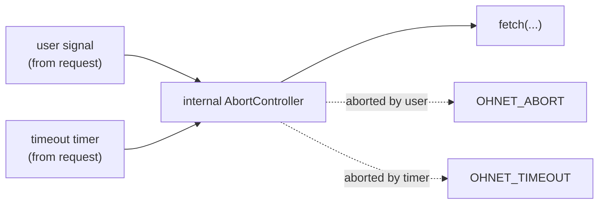
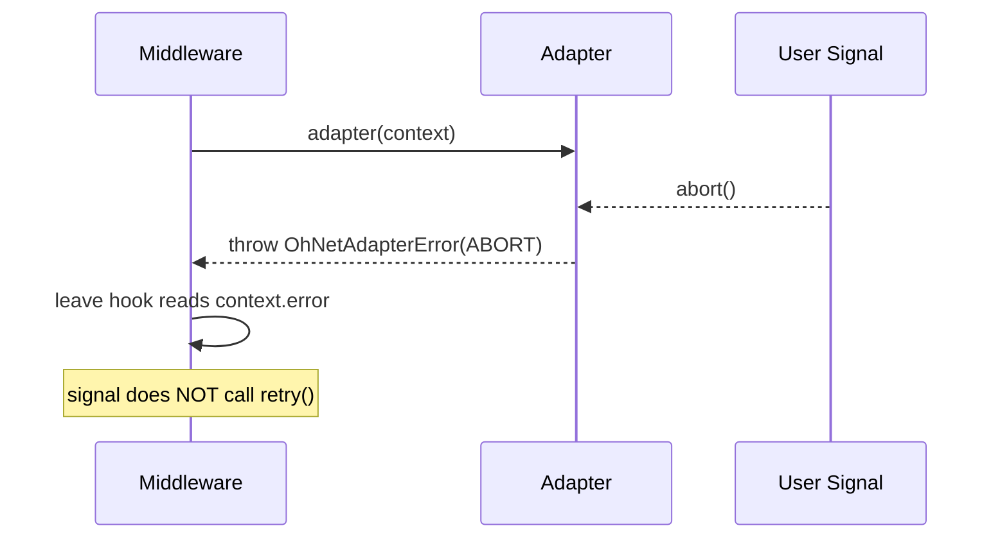

# {{ $frontmatter.title }}

ohnet exposes cancellation as a duck-typed interface that matches the shape every common transport expects, and ships a small self-contained controller plus a subscription helper for adapter authors. This page explains the abstraction, when to use which signal source, and what actually happens between your `request({ signal })` call and the transport.

## Why a Duck-Typed Signal

`OhNetSignal` is intentionally not pinned to the browser `AbortSignal` class. The interface accepts three subscription shapes, all optional:

- W3C `addEventListener`: native `AbortSignal`, browser, Node 18+, Deno, Bun
- Callback `onAbort`: hand-rolled signals, third-party SDKs without event APIs
- Flag-only `aborted`: read-once polling when subscription is not available

A single duck-typed interface lets the same pipeline drive `fetch`, `XMLHttpRequest`, axios, a custom SDK, or an in-memory mock without adapter-side branching. Adapters always go through `subscribeAbort`, which picks the highest-priority shape available and falls back gracefully when none is offered.

## The Interface

```ts
interface OhNetSignal {
  readonly aborted: boolean
  reason?: unknown
  addEventListener?: (type: "abort", listener: () => void) => void
  removeEventListener?: (type: "abort", listener: () => void) => void
  onAbort?: () => void
}
```

Three things stand out:

- `aborted` is the only required field. Everything else is optional.
- `reason` carries whatever was passed to `abort(reason)`. Untyped on purpose: adapters that want a typed reason narrow it themselves.
- Only the `"abort"` event type is meaningful. `addEventListener` with any other type is a no-op.

The full API surface lives in [API Reference](../reference/signal.md).

## `OhNetController` vs Native `AbortController`

The library ships `OhNetController` for one reason: there are still JavaScript runtimes where `AbortController` is not on the global, and adapters must work there. Pick based on your environment, not on ohnet's preferences:

- Browsers, Node 18+, Deno, Bun, Workers, Edge: use the platform `AbortController`. Native is fine everywhere.
- Embedded JS engines, older runtimes, polyfills: use `OhNetController`. No global dependency.
- Library code targeting any runtime: use `subscribeAbort` against any duck-typed signal.

```ts
// Native, in any modern runtime
// Self-contained, no global needed
import { OhNetController } from "@xtwis/ohnet"

const controller = new AbortController()
controller.abort("user cancelled")
await client.request({ signal: controller.signal })
const controller = new OhNetController()
controller.abort("user cancelled")
await client.request({ signal: controller.signal })
```

The two are interchangeable from ohnet's perspective. The signal contract is the same; the implementation underneath is irrelevant.

## Using Signals in Your Requests

Signals are a per-request override, set on `request({ signal })` or via any verb helper that takes a config:

```ts
const controller = new AbortController()
controller.abort() // before the request even starts

try {
  await client.append("/items").request({ method: "GET", signal: controller.signal })
}
catch (error) {
  // error.code === OHNET_ADAPTER_ERROR_CODE.ABORT
  // error.data carries controller.signal.reason when one was supplied
}
```

Three behaviors worth knowing:

- An already-aborted signal is **honored synchronously**. The adapter sees `aborted: true` before any other work and rejects immediately. There is no race with a slow dispatcher.
- The signal you pass is forwarded to the adapter verbatim. ohnet does not wrap or copy it, so do not abort and then expect to inspect the same object later from a middleware.
- A signal that aborts after the adapter has resolved has no effect. Once `context.response` is set, the dispatcher ignores further signals and resolves normally.

## How Signals Reach the Adapter

When the built-in `fetchAdapter` runs, it does not pass your `signal` straight to `fetch`. It builds an internal `AbortController` and wires two sources into it:



This is why `OHNET_ABORT` and `OHNET_TIMEOUT` are distinguishable in catch sites even though both come from the same `AbortError`:

- User signal fired: `OHNET_ABORT`
- `request.timeout` elapsed: `OHNET_TIMEOUT`
- Transport rejection (DNS, TLS, etc.): `OHNET_NETWORK`

The mapping is done in the adapter, so it only applies when you use the built-in `fetchAdapter`. A custom adapter that fails to distinguish the two will surface every abort as `OHNET_ABORT` (or whatever code it picks); see [Writing Adapters That Handle Signals](#writing-adapters-that-handle-signals) below.

## Signals and Middleware Retries

The dispatcher retries only when middleware **explicitly** calls `controls.retry()`. A signal abort is a transport-level event, not a retry decision:



What this means in practice:

- Aborting mid-request never counts against `request.middlewareRetries`. The counter only tracks middleware-driven retries.
- A middleware may still call `controls.retry()` on an aborted request. The dispatcher will run the next attempt, but the same signal is still aborted and the next attempt will fail with `OHNET_ABORT` immediately. Use a fresh signal (or a fresh `AbortController`) for the retry to have any chance.
- `OHNET_ABORT` is terminal: it appears on `context.error` and is rethrown by the builder, never wrapped in `OHNET_UNKNOWN`.

## Writing Adapters That Handle Signals

Three responsibilities fall on every adapter that wants to honor cancellation:

1. **Subscribe** to the signal.
2. **Abort** the underlying transport when the signal fires.
3. **Reject** with `OhNetAdapterError(ABORT)` (or the appropriate code) so the catch site can branch.

The library ships `subscribeAbort` for step 1 because the three subscription shapes are too fiddly to handle inline:

```ts
import {
  OHNET_ADAPTER_ERROR_CODE,
  OHNET_ADAPTER_ERROR_MESSAGE,
  OhNetAdapterError,
  subscribeAbort,
} from "@xtwis/ohnet"

function adapter(context) {
  return new Promise((resolve, reject) => {
    const { signal } = context.request

    // subscribeAbort returns a no-op when signal is null/undefined,
    // runs the listener synchronously when the signal is already aborted,
    // and unwinds correctly on either subscription shape.
    const unsubscribe = subscribeAbort(signal, () => {
      reject(new OhNetAdapterError(
        OHNET_ADAPTER_ERROR_CODE.ABORT,
        OHNET_ADAPTER_ERROR_MESSAGE.ABORT,
      ))
    })

    // ... start the underlying transport, propagate cancellation into it ...
  })
}
```

`fetchAdapter` and a complete `XMLHttpRequest`-based adapter both demonstrate the full pattern. See [Adapter](./adapter.md) for the XHR template, and [Custom Transports](../example/transport.md) for axios, gRPC, and WebSocket examples.

## Common Mistakes

A few pitfalls that look right but produce silent failures:

- **Forgetting `signal?.addEventListener?.("abort", ...)`.** Both `?.` chains are mandatory. A native `AbortSignal` exposes the method, but `OhNetSignal` types it as optional, and a custom signal may omit it. Calling `signal.addEventListener` directly on a duck-typed signal that does not implement it crashes before the request even starts.
- **Storing the unsubscribe and never calling it.** When the request resolves, leaving the listener attached means a later `abort()` call still fires the rejection handler. The catch site sees `OHNET_ABORT` for a request that already returned successfully.
- **Reading `aborted` only once.** A signal can flip between checks. Either subscribe to changes or assume the worst at every point where the transport can still respond to cancellation.

## Next

- [Adapter](./adapter.md): the transport boundary and how to write your own.
- [HTTP Requests](./http.md): `responseType`, `params`, and per-request options.
- [Error Handling](./errors.md): the three error classes you can branch on.
