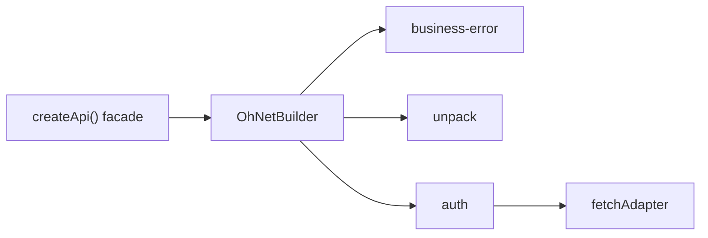

# {{ $frontmatter.title }}

本示例把 ohnet 打造成某个具体后端的类型化 SDK. 该后端把每个响应都包进信封, 要求 Bearer token, 并用 `200 OK` body 里的数字 `code` 表达业务失败. 最终客户端会把这一切藏在 `api.me.get()` 这样的普通方法背后.

## 契约

每个端点都返回同一个信封:

```json
{ "code": 0, "data": {}, "message": "ok" }
```

- `code: 0` 表示成功; `data` 是载荷.
- 其他 `code` 是业务失败; `data` 携带细节.
- `code: 401` 表示 access token 过期, 应刷新后重试.
- 鉴权使用 `Authorization: Bearer <token>`.

目标: 调用方只会看到 `data`, 失败则以类型化错误的形式到达.

## 分层



注册顺序为上述三个中间件. 因为 `leave` 钩子逆序执行, auth 钩子最先看到原始信封, 然后 unpack 拆掉它, 最后错误映射器检查剩下的内容.

## 1. 类型化错误

从 `OhNetError` 派生, 错误才能保持 `instanceof` 友好, 并保留 `type` / `code` / `data` 结构.

```ts
import { OhNetError } from "@xtwis/ohnet"

export class BusinessError extends OhNetError {
  constructor(code: number, message: string, data?: unknown) {
    super("BUSINESS", String(code), message, data)
  }
}

export class UnauthorizedError extends BusinessError {
  constructor(data?: unknown) {
    super(401, "unauthorized", data)
  }
}

export class NotFoundError extends BusinessError {
  constructor(data?: unknown) {
    super(404, "not found", data)
  }
}

export class ValidationError extends BusinessError {
  constructor(data?: unknown) {
    super(422, "validation failed", data)
  }
}

export class AuthExpiredError extends OhNetError {
  constructor() {
    super("AUTH", "AUTH_EXPIRED", "auth refresh failed")
  }
}
```

## 2. 共享的信封守卫

两个中间件都需要判断 body 是不是信封. 一个类型守卫把该判断收敛到一处.

```ts
interface Envelop {
  code: number
  data: unknown
  message: string
}

function isEnvelop(value: unknown): value is Envelop {
  return typeof value === "object" && value !== null
    && "code" in value && "data" in value && "message" in value
}
```

## 3. 拆封信封

成功时用内层载荷替换 `response.data`. 其他都不变, 因此调用方的 `T` 描述的是载荷, 而不是信封.

```ts
import type { OhNetAdapter, OhNetContext } from "@xtwis/ohnet"
import { OhNetMiddleware } from "@xtwis/ohnet"

class UnpackMiddleware extends OhNetMiddleware {
  readonly name = "unpack"

  readonly leave = async (_adapter: OhNetAdapter, context: OhNetContext): Promise<void> => {
    if (!context.response)
      return
    const body = context.response.data
    if (isEnvelop(body) && body.code === 0)
      context.response.data = body.data
  }
}
```

## 4. 把业务 code 映射为错误

当信封携带非零 `code` 时抛出对应类. `controls.terminate()` 停止后续 leave 链, 这样后面的中间件不会看到一个即将变成异常的 body.

```ts
import type { OhNetMiddlewareLeaveControls } from "@xtwis/ohnet"

const ERROR_MAP: Record<number, new (data?: unknown) => BusinessError> = {
  401: UnauthorizedError,
  404: NotFoundError,
  422: ValidationError,
}

class BusinessErrorMiddleware extends OhNetMiddleware {
  readonly name = "business-error"

  readonly leave = async (
    _adapter: OhNetAdapter,
    context: OhNetContext,
    controls: OhNetMiddlewareLeaveControls,
  ): Promise<void> => {
    if (!context.response)
      return
    const body = context.response.data
    if (!isEnvelop(body) || body.code === 0)
      return

    controls.terminate()

    const ErrorClass = ERROR_MAP[body.code]
    if (ErrorClass)
      throw new ErrorClass(context.response)
    throw new BusinessError(body.code, body.message, context.response)
  }
}
```

整个响应会作为 `error.data` 挂上, 因此 catch 处仍能读取 status, headers 和原始信封:

```ts
try {
  await api.me.get()
}
catch (error) {
  if (error instanceof NotFoundError) {
    const response = error.data as { status: number }
    console.log(response.status) // 200
  }
}
```

## 5. 401 时刷新

auth 中间件在进入时注入 token, 在返回时刷新. `401` 是重试信号, 不是面向用户的失败.

```ts
import { OhNetBuilder } from "@xtwis/ohnet"

interface AuthOptions {
  getToken: () => string | undefined
  refresh: () => Promise<Session>
  onTokens: (session: Session) => void
}

class AuthMiddleware extends OhNetMiddleware {
  readonly name = "auth"

  constructor(private readonly options: AuthOptions) {
    super()
  }

  readonly enter = async (_adapter: OhNetAdapter, context: OhNetContext): Promise<void> => {
    const token = this.options.getToken()
    if (token)
      context.request.headers.set("Authorization", `Bearer ${token}`)
  }

  readonly leave = async (
    _adapter: OhNetAdapter,
    context: OhNetContext,
    controls: OhNetMiddlewareLeaveControls,
  ): Promise<void> => {
    if (!context.response)
      return
    const body = context.response.data
    if (!isEnvelop(body) || body.code !== 401)
      return

    try {
      const session = await this.options.refresh()
      this.options.onTokens(session)
      controls.retry()
    }
    catch {
      controls.terminate()
      throw new AuthExpiredError()
    }
  }
}
```

`controls.retry()` 安排一次完整的管线运行. 调度器会先清空 `response` 和 `error`, 因此重试从干净状态开始, 重新进入每个 `enter` 钩子 (此时已带新 token), 并再次调用适配器.

## 6. 建模类型

facade 用领域语言表达: `Session`, `User`, token 存储, 以及按域分组的 `Api`.

```ts
export interface Session {
  accessToken: string
  refreshToken: string
  expiresIn: number
}

export interface User {
  id: string
  name: string
  email: string
}

export interface TokenStorage {
  get: () => { accessToken: string, refreshToken: string } | undefined
  set: (session: Session) => void
  clear: () => void
}

export interface Api {
  auth: {
    login: (data?: unknown) => Promise<Session>
    logout: () => Promise<null>
  }
  me: {
    get: () => Promise<User>
  }
}
```

## 7. 组装 facade

刷新请求绝不能经过 auth 中间件, 否则过期 token 会触发刷新, 而刷新又触发刷新, 永无止境. 因此构建第二个只负责解包和映射错误的客户端, 用它请求 `/auth/refresh`. facade 随后只是一组箭头函数: 每个方法选定动词, 固定路径, 声明载荷类型. 信封, token, 状态码都不外泄.

```ts
export function createApi(options: {
  baseURL: string
  storage: TokenStorage
}): Api {
  // 这里不挂 auth 中间件: 这个客户端负责刷新 token.
  const refreshClient = new OhNetBuilder({ url: options.baseURL })
    .with(new UnpackMiddleware())
    .with(new BusinessErrorMiddleware())

  const auth = new AuthMiddleware({
    getToken: () => options.storage.get()?.accessToken,
    refresh: async (): Promise<Session> => {
      const pair = options.storage.get()
      if (!pair)
        throw new AuthExpiredError()
      return refreshClient.post<Session>("/auth/refresh", { refreshToken: pair.refreshToken })
    },
    onTokens: session => options.storage.set(session),
  })

  const client = new OhNetBuilder({ url: options.baseURL })
    .with(new BusinessErrorMiddleware())
    .with(new UnpackMiddleware())
    .with(auth)

  return {
    auth: {
      login: data => client.post<Session>("/auth/login", data ?? {}),
      logout: () => client.post<null>("/auth/logout"),
    },
    me: {
      get: () => client.get<User>("/auth/me"),
    },
  }
}
```

## 401 时会发生什么

当 `business-error`, `unpack`, `auth` 按上述顺序注册时, 过期 token 会产生如下序列:

1. `auth.enter` 附上 `Authorization: Bearer <stale>`.
2. 适配器返回 `{ code: 401 }` 和 `200 OK`.
3. `auth.leave` 最先运行, 看到 `401`, 刷新并调用 `controls.retry()`.
4. 调度器放弃当前 leave 链并重跑管线.
5. `auth.enter` 附上新 token; 适配器返回真实载荷.
6. `auth.leave` 看到 `code: 0` 直接返回; `unpack` 解包; `business-error` 看到普通载荷后返回.
7. 调用方拿到 `data`, 完全不知道发生过刷新.

如果刷新本身失败, `auth.leave` 会调用 `controls.terminate()` 并抛出 `AuthExpiredError`, 重试和剩余的 leave 钩子都会被跳过.

## 下一步

- [中间件食谱](./middleware.md): 本示例只勾勒了轮廓的可复用部件.
- [测试与模拟适配器](./testing.md): 在没有网络的情况下验证这套流程.
- [错误处理](../guide/errors.md): 完整的错误层次.
