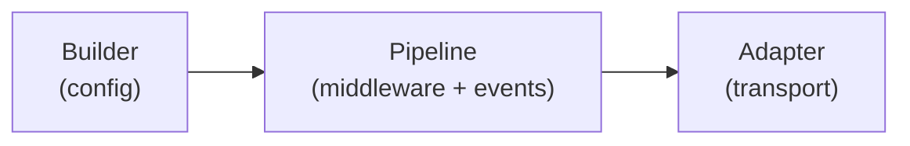
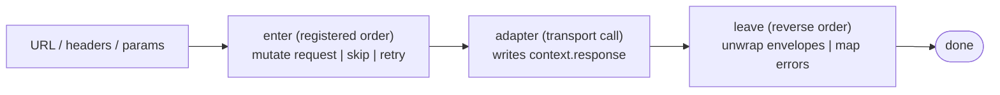

# {{ $frontmatter.title }}

在深入各个 API 之前, 本页勾勒 ohnet 的整体架构. 库本身只有三个核心部件, 其他都依附于它们.

## 三个核心部件

- **Builder**: 入口. 保存 URL, headers, 中间件, 事件处理器. 每次配置调用都返回派生实例, 不会被修改.
- **Pipeline**: 运行时, 将请求依次通过中间件并交给适配器. 发出生命周期事件, 支持 `skip` / `terminate` / `retry` 控制.
- **Adapter**: ohnet 与具体传输层之间的唯一接缝. 适配器匹配一个小的 `(context) => Promise<response>` 签名, 因此同一套管道可以驱动 `fetch`, `axios`, gRPC, `WebSocket` 或内存 mock.

三者有意保持独立. 你可以替换传输而不动中间件, 增加中间件而不动 Builder, 或编写新的 Builder 包装而不影响其他两者.

## 请求流转

事件时序: `START`, 然后 `REQUEST`, 然后 adapter, 然后 `RESPONSE`, 然后 `SUCCESS` / `SKIP` / `ERROR` 之一, 然后 `FINISH`.

每个中间件看到同一个 `context` 对象: 在适配器调用前可读写 `request`, 调用后可检查 `response` 或 `error`.

## 什么不是核心概念

有几样东西看似抽象, 但被刻意保持简单:

- **Headers**: 仅仅是带 RFC 7230 校验的 `OhNetHeader` 集合. 没有额外的 API 学习成本.
- **Errors**: 一个扁平的层次. 用 `instanceof` 和 `code` 分支, 永远不依赖 `message`.
- **Events**: 八个命名钩子. 通过 `.on(event, fn)` 注册, 仅此而已.

## 下一步

你已经掌握整体, 可以继续阅读其他章节. 从最关心的开始:

- [Builder](./builder.md): 最常用的 API 表面.
- [Pipeline](./pipeline.md): 中间件与生命周期事件.
- [Adapter](./adapter.md): 传输层边界, 以及如何编写自己的.
