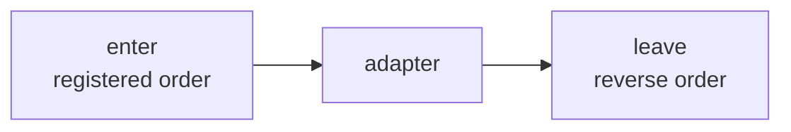
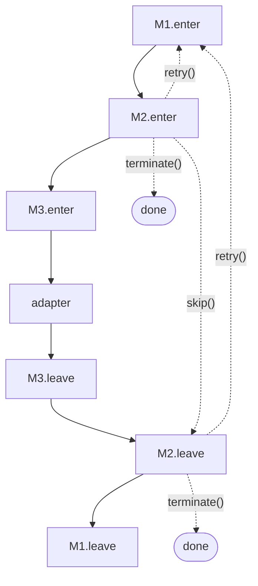
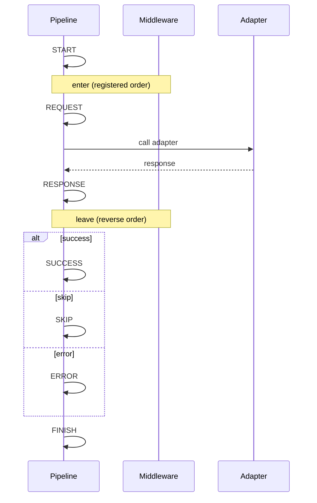

# {{ $frontmatter.title }}

管线是将每次请求依次穿过中间件并交给适配器的运行时. 它掌管请求生命周期, 控制流 (`skip` / `terminate` / `retry`) 以及八个生命周期事件.

## 中间件

继承 `OhNetMiddleware` 即可接入请求管线. 一个中间件有稳定的 `name`, 可选的 `enter` 钩子, 可选的 `leave` 钩子:

```ts
import type { OhNetContext } from "@xtwis/ohnet"
import { OhNetMiddleware } from "@xtwis/ohnet"

class TimingMiddleware extends OhNetMiddleware {
  readonly name = "timing"

  enter(_adapter, context) {
    context.meta.startedAt = Date.now()
  }

  leave(_adapter, context) {
    const started = context.meta.startedAt as number
    console.log(`elapsed: ${Date.now() - started}ms`)
  }
}
```

### 钩子顺序



`enter` 钩子在适配器调用前按注册顺序执行. `leave` 钩子在适配器返回后按**相反**的注册顺序执行. 这一对组合跟 Koa / 洋葱中间件同形: 每个中间件的 `leave` 看到的是后续中间件已经写入过的上下文.

### `name`

`name` 是稳定的字符串, 用于替换与移除的身份标识. 注册两个同名中间件会替换同一槽位实现; 用同名调用 `clean()` 会整体移除.

`name` 不能为空. 空白字符串会在生效前被 `OHNET_MIDDLEWARE_NAME` 拒绝.

## Controls

每个钩子收到一个 `controls` 对象:

| Method                 | Phase          | Effect                                                                                          |
| ---------------------- | -------------- | ----------------------------------------------------------------------------------------------- |
| `controls.skip()`      | enter          | 适配器不执行, 除非 `context.response` 已写入 (此时 `SUCCESS` 优先), 否则以 `OHNET_SKIPPED` 结束 |
| `controls.terminate()` | enter 或 leave | 后续 `enter` (或 `leave`) 钩子不再执行                                                          |
| `controls.retry()`     | enter 或 leave | 重新跑整条管线, 上限为 `request.middlewareRetries`                                              |

`skip` 和 `terminate` 都会短路, 但抑制的范围不同: `skip` 仅停止 enter 链 (leave 仍会跑), `terminate` 同时停止 enter 与 leave.

`retry()` 安排一次全新的管线运行. 每次调用递增重试计数; 超过 `request.middlewareRetries` (默认 `1`) 后请求以 `OHNET_RETRY_EXHAUSTED` 失败.

### Controls in the Pipeline



`skip` 和 `terminate` 都会短路, 但抑制的范围不同: `skip` 仅停止 enter 链 (leave 仍会跑), `terminate` 同时停止 enter 与 leave.

`retry()` 安排一次全新的管线运行. 每次调用递增重试计数; 超过 `request.middlewareRetries` (默认 `1`) 后请求以 `OHNET_RETRY_EXHAUSTED` 失败.

### Retry 示例

```ts
import type { OhNetContext, OhNetMiddlewareLeaveControls } from "@xtwis/ohnet"
import { OhNetMiddleware } from "@xtwis/ohnet"

class NetworkRetryMiddleware extends OhNetMiddleware {
  readonly name = "network-retry"
  readonly leave = async (
    _adapter,
    context: OhNetContext,
    controls: OhNetMiddlewareLeaveControls,
  ) => {
    const code = (context.error as { code?: string } | null)?.code
    if (code === "OHNET_NETWORK")
      controls.retry()
  }
}

const client = new OhNetBuilder({
  url: "https://api.example.com",
  middlewareRetries: 3,
}).with(new NetworkRetryMiddleware())
```

## 生命周期事件

通过 `OHNET_EVENT` 常量注册任意一个事件的处理器:

```ts
import { OHNET_EVENT } from "@xtwis/ohnet"

const client = new OhNetBuilder({ url: BASE })
  .on(OHNET_EVENT.START, (_, ctx) => trace.begin(ctx.request.url))
  .on(OHNET_EVENT.SUCCESS, (_, ctx) => trace.end(ctx.response?.status))
  .on(OHNET_EVENT.ERROR, (_, ctx) => trace.fail(ctx.error))
  .on(OHNET_EVENT.FINISH, () => trace.flush())
```

### 事件顺序



每次请求的顺序: `START`, 然后 `REQUEST`, 然后 adapter, 然后 `RESPONSE`, 然后 `SUCCESS` / `SKIP` / `ERROR` 之一, 然后 `FINISH`. 当中间件调用 `controls.retry()`, 调度器会重跑管线并在下次尝试的顶部发出 `RETRY`.

### 八个事件

| Event      | When                                                         |
| ---------- | ------------------------------------------------------------ |
| `START`    | 管线开始, 在任何中间件运行前发出                             |
| `RETRY`    | 重试尝试的顶部 (首次尝试不发出)                              |
| `REQUEST`  | 所有 `enter` 钩子已跑完, 适配器即将被调用                    |
| `RESPONSE` | 适配器 (或中间件) 已生成 `context.response`                  |
| `SUCCESS`  | 终止事件: `context.response` 已设置, `context.error` 为 null |
| `SKIP`     | 终止事件: 管线被短路                                         |
| `ERROR`    | 终止事件: `context.error` 非空                               |
| `FINISH`   | 总是最后发出, 用于全路径清理                                 |

同一事件的多个处理器按注册顺序触发. 处理器异常会被**捕获并丢弃**, 永远不会影响管线结果, 因此观察者崩溃也不会破坏请求.

## 下一步

- [Adapter](./adapter.md): 传输层边界, 以及如何编写自己的适配器.
- [错误处理](./errors.md): 你可以基于其分支的三层错误类.
- [HTTP Requests](./http.md): `responseType`, `params`, 以及每请求选项.
