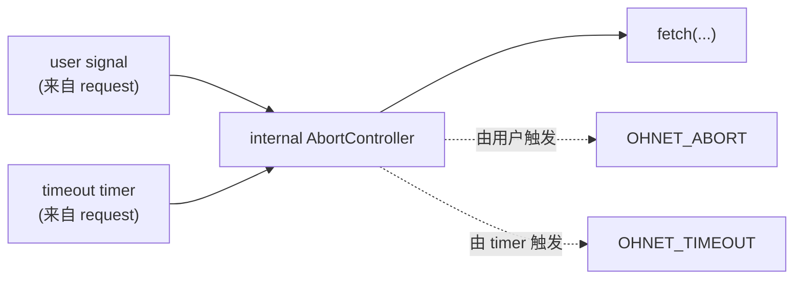
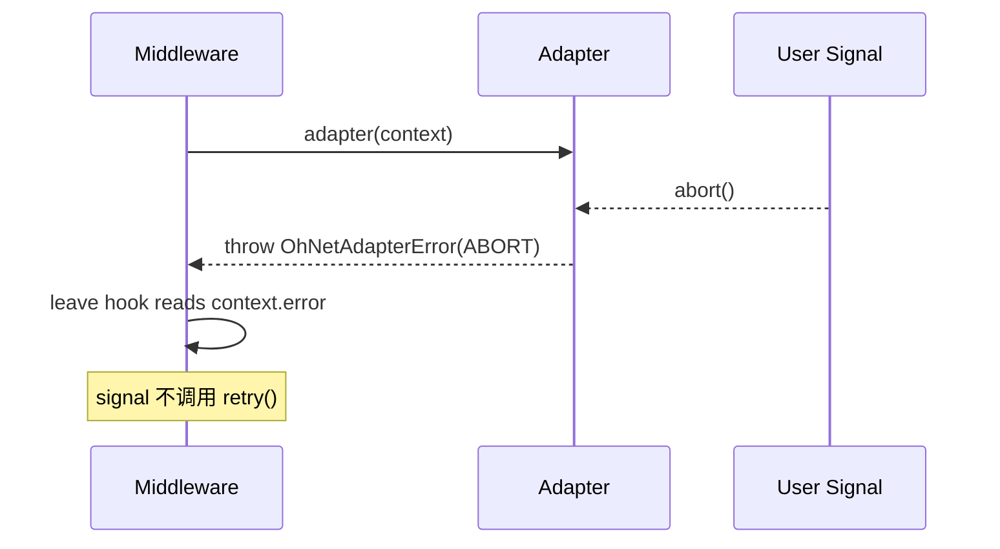

# {{ $frontmatter.title }}

ohnet 把取消语义建模成一个鸭子类型接口, 它匹配每种常见传输的形态, 同时自带一个自包含的 controller 与一个供适配器作者使用的订阅辅助函数. 本页解释这个抽象, 何时该用哪种信号源, 以及从 `request({ signal })` 调用到底层传输之间到底发生了什么.

## 为什么要用鸭子类型信号

`OhNetSignal` 故意不绑定到浏览器 `AbortSignal` 类. 接口接受三种订阅形态, 全部可选:

- W3C `addEventListener`: 原生 `AbortSignal`, 浏览器, Node 18+, Deno, Bun
- 回调 `onAbort`: 手写信号, 没有事件 API 的第三方 SDK
- 仅标志位 `aborted`: 无订阅能力时的只读轮询

单一的鸭子类型接口让同一套管线可以驱动 `fetch`, `XMLHttpRequest`, axios, 自定义 SDK 或内存 mock, 适配器侧不需要分支. 适配器都通过 `subscribeAbort` 工作, 它会按优先级选用最高级的形态, 在没有任何形态可用时优雅退化.

## 接口

```ts
interface OhNetSignal {
  readonly aborted: boolean
  reason?: unknown
  addEventListener?: (type: "abort", listener: () => void) => void
  removeEventListener?: (type: "abort", listener: () => void) => void
  onAbort?: () => void
}
```

三个值得注意的点:

- `aborted` 是唯一必需字段. 其他都是可选.
- `reason` 携带传给 `abort(reason)` 的值. 故意不加类型: 需要特定 reason 类型的适配器自己收窄.
- 只有 `"abort"` 事件类型是有意义的. `addEventListener` 传入任何其他类型都是 no-op.

完整的 API 见 [API 参考](../reference/signal.md).

## `OhNetController` vs 原生 `AbortController`

库自带 `OhNetController` 的唯一理由: 仍有 JavaScript 运行时没有把 `AbortController` 放到全局, 适配器必须能跑在那里. 按环境选, 不要按 ohnet 的偏好:

- 浏览器, Node 18+, Deno, Bun, Workers, Edge: 用平台 `AbortController`. 原生在所有地方都够用.
- 嵌入式 JS 引擎, 旧版运行时, polyfill: 用 `OhNetController`. 没有全局依赖.
- 面向任意运行时的库代码: 用 `subscribeAbort` 配合任意鸭子类型信号.

```ts
// 原生, 任何现代运行时
// 自包含, 不依赖全局
import { OhNetController } from "@xtwis/ohnet"

const controller = new AbortController()
controller.abort("user cancelled")
await client.request({ signal: controller.signal })
const controller = new OhNetController()
controller.abort("user cancelled")
await client.request({ signal: controller.signal })
```

两者在 ohnet 看来是可互换的. 信号契约相同, 底下实现无关紧要.

## 在请求中使用信号

信号是每请求覆盖, 通过 `request({ signal })` 或任何接受配置的动词助手传入:

```ts
const controller = new AbortController()
controller.abort() // 在请求启动前就已经取消

try {
  await client.append("/items").request({ method: "GET", signal: controller.signal })
}
catch (error) {
  // error.code === OHNET_ADAPTER_ERROR_CODE.ABORT
  // error.data 在传了 reason 的情况下携带 controller.signal.reason
}
```

三个值得了解的行为:

- **已经取消的信号会被同步尊重**. 适配器在做任何工作之前就看到 `aborted: true` 并立即 reject. 与慢调度器之间没有竞态.
- 你传入的信号会原样转发给适配器. ohnet 不会包装也不会复制, 所以不要 abort 之后又期望在中间件里稍后看到同一个对象.
- 适配器已经 resolve 之后再 abort 的信号不会起作用. 一旦 `context.response` 被设置, 调度器会忽略后续信号并正常 resolve.

## 信号如何到达适配器

内置的 `fetchAdapter` 运行时, 它并不会把你的 `signal` 直接传给 `fetch`. 它会构造一个内部 `AbortController`, 并把两个来源挂上去:



这就是为什么 `OHNET_ABORT` 与 `OHNET_TIMEOUT` 在 catch 处可以区分, 虽然它们背后是同一个 `AbortError`:

- 用户信号触发: `OHNET_ABORT`
- `request.timeout` 到期: `OHNET_TIMEOUT`
- 传输层拒绝 (DNS, TLS 等): `OHNET_NETWORK`

映射在适配器内完成, 因此只有使用内置 `fetchAdapter` 时才生效. 一个没有区分这两种情况的定制适配器会把所有 abort 都表层化为 `OHNET_ABORT` (或者它选的任何 code); 见下方的 [编写处理信号的适配器](#编写处理信号的适配器).

## 信号与中间件重试

调度器只在中间件**显式**调用 `controls.retry()` 时才重试. 信号 abort 是传输层事件, 不是重试决定:



实际含义:

- 中途 abort 不计入 `request.middlewareRetries`. 计数器只跟踪中间件驱动的重试.
- 中间件仍可能在已 abort 的请求上调用 `controls.retry()`. 调度器会跑下一次尝试, 但同一个信号仍处于 aborted, 下一次尝试立刻以 `OHNET_ABORT` 失败. 想让重试有机会成功, 用一个新信号 (或新 `AbortController`).
- `OHNET_ABORT` 是终态: 它出现在 `context.error` 上并由 builder 重抛, 不会被包成 `OHNET_UNKNOWN`.

## 编写处理信号的适配器

每个希望响应取消的适配器都肩负三个职责:

1. **订阅** 信号.
2. 在信号触发时**中止**底层传输.
3. **reject** 为 `OhNetAdapterError(ABORT)` (或合适的 code), 让 catch 处能分支.

库自带 `subscribeAbort` 处理第一步, 因为三种订阅形态零散地内联处理很麻烦:

```ts
import {
  OHNET_ADAPTER_ERROR_CODE,
  OHNET_ADAPTER_ERROR_MESSAGE,
  OhNetAdapterError,
  subscribeAbort,
} from "@xtwis/ohnet"

function adapter(context) {
  return new Promise((resolve, reject) => {
    const { signal } = context.request

    // subscribeAbort 在 signal 为 null/undefined 时返回 no-op,
    // 在 signal 已 aborted 时同步触发 listener,
    // 在任一订阅形态下都能正确解开.
    const unsubscribe = subscribeAbort(signal, () => {
      reject(new OhNetAdapterError(
        OHNET_ADAPTER_ERROR_CODE.ABORT,
        OHNET_ADAPTER_ERROR_MESSAGE.ABORT,
      ))
    })

    // ... 启动底层传输, 把取消信号传播给它 ...
  })
}
```

`fetchAdapter` 与一个完整的基于 `XMLHttpRequest` 的适配器都演示了完整模式. 完整 XHR 模板见 [Adapter](./adapter.md), axios, gRPC, WebSocket 示例见 [自定义传输层](../example/transport.md).

## 常见误区

看起来对但实际会悄悄失败的几个坑:

- **忘了写 `signal?.addEventListener?.("abort", ...)`.** 两条 `?.` 都是必需的. 原生 `AbortSignal` 暴露该方法, 但 `OhNetSignal` 类型上它是可选的, 自定义信号也可能省略它. 在没有实现该方法的鸭子类型信号上直接 `signal.addEventListener` 会在请求开始前就崩溃.
- **保存了 unsubscribe 却从不调用.** 请求 resolve 后, 监听器仍挂载意味着之后的 `abort()` 仍会触发 reject handler. catch 处看到一个已经成功返回的请求被表层化为 `OHNET_ABORT`.
- **只读一次 `aborted`.** 信号可能在两次检查之间翻转. 要么订阅变化, 要么在每个底层传输还能响应取消的位置都按最坏情况处理.

## 下一步

- [Adapter](./adapter.md): 传输层边界, 以及如何编写自己的.
- [HTTP 请求](./http.md): `responseType`, `params`, 以及每请求选项.
- [错误处理](./errors.md): 你可以基于其分支的三层错误类.
